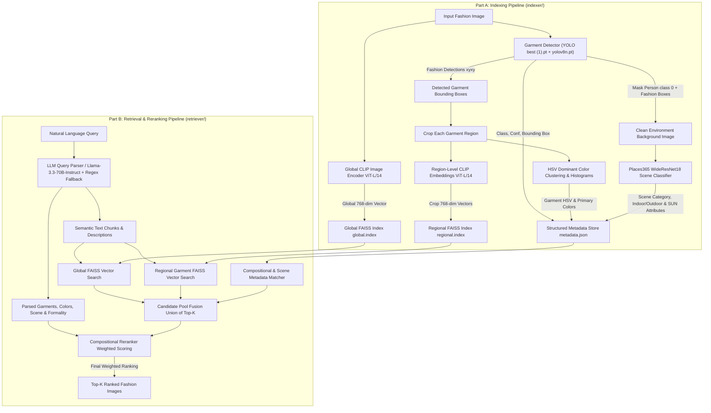

# Glance: Advanced Fashion Retrieval Pipeline (Regional & Global Indexing with Compositional Retrieval)

Glance is a state-of-the-art, modular fashion retrieval engine that powers compositional text-to-image search across complex fashion datasets. By combining **global semantic embeddings**, **regional garment cropping via YOLO**, **clean environment extraction via dual-masking**, and **multi-modal compositional reranking**, Glance allows users to search using highly expressive natural language queries (e.g., *"a yellow raincoat and black pants in a rainy street"* or *"a blue shirt and a brown belt in a formal office setting"*).

---

## 🏛️ End-to-End System Architecture

The pipeline is structured cleanly into two decoupled workflows: **Part A (Indexing Pipeline)** and **Part B (Retrieval & Reranking Pipeline)**.



---

## 📂 Complete Modular Directory & File Structure

```text
Glance/
├── indexer/                                # Part A: Core Indexing Modules
│   ├── __init__.py                         # Exports core indexing classes and utilities
│   ├── fashion_indexer.py                  # Orchestrates full indexing flow across all components
│   ├── garment_detector.py                 # Dual YOLO detector: crops garments & masks person+clothes for clean background
│   ├── clip_encoder.py                     # OpenAI CLIP (ViT-L/14) vector extraction for full images, crops, and text
│   ├── color_extractor.py                  # HSV color analysis: KMeans dominant clustering, histograms & human color labels
│   ├── scene_extractor.py                  # Places365 (WideResNet18) classifier operating on cleaned background images
│   └── vector_store.py                     # Multi-index FAISS manager (global.index & regional.index + ID maps)
│
├── retriever/                              # Part B: Core Retrieval & Reranking Modules
│   ├── __init__.py                         # Exports core retrieval classes and utilities
│   ├── query_parser.py                     # OpenAI SDK + Hugging Face Llama-3.3 JSON parser + deterministic regex fallback
│   ├── candidate_retriever.py              # Global + regional FAISS vector search, candidate aggregation & score fusion
│   ├── compositional_matcher.py            # Evaluates garment label/color matching & scene keyword/attribute scoring
│   ├── reranker.py                         # Multi-modal weighted reranker applying 0.30/0.40/0.20/0.10 weights formula
│   ├── search.py                           # High-level FashionRetriever unified search & indexing API
│   ├── retriever.py                        # Compatibility wrapper exposing FashionRetriever cleanly from search.py
│   └── test_retrieval.py                   # Verification suite indexing D:\val_test2020\test & running compositional queries
│
├── weights/                                # Clean separation of all model weights and checkpoints
│   ├── yolo/
│   │   ├── best (1).pt                     # Fashionpedia YOLO weights (trained on 43 epochs across 29 classes)
│   │   └── yolov8n.pt                      # Pretrained COCO YOLO weights (used strictly for 'person' class detection)
│   └── places365/
│       ├── wideresnet18_places365.pth.tar  # Places365 WideResNet18 PyTorch model weights checkpoint
│       ├── categories_places365.txt        # 365 Places365 scene categories list
│       ├── IO_places365.txt                # Indoor vs. Outdoor category classification labels
│       ├── labels_sunattribute.txt         # 102 SUN scene attribute labels
│       ├── W_sceneattribute_wideresnet18.npy # WideResNet18 to SUN attribute projection weight matrix
│       └── wideresnet.py                   # PyTorch WideResNet architecture definition
│
├── evaluate/                               # Evaluation & Benchmarking Suite
│   ├── __init__.py                         # Package init with usage instructions
│   ├── index_all.py                        # Indexes ALL images from D:\val_test2020\test into FAISS
│   ├── run_evaluation.py                   # Runs 5 official evaluation queries and saves detailed results
│   └── results/                            # Auto-generated evaluation output directory
│       └── evaluation_results.json         # Full JSON results with score breakdowns per query
│
├── index_store/                            # Persistent index storage generated during indexing
│   ├── global.index                        # FAISS IndexFlatIP for global 768-dim image vectors
│   ├── global_ids.json                     # Mapping of global vector indices to image file paths
│   ├── regional.index                      # FAISS IndexFlatIP for regional 768-dim garment crop vectors
│   ├── regional_ids.json                   # Mapping of regional vector indices to crop IDs (path#crop_i)
│   └── metadata.json                       # Comprehensive JSON metadata for every indexed image and crop
│
└── README.md                               # Exhaustive technical reference and system documentation
```

---

## ⚖️ Weights & Model Management Specification

All deep learning models and weight checkpoints are centrally organized under `weights/` and loaded dynamically via workspace-portable relative paths:

### 1. Fashionpedia YOLO (`weights/yolo/best (1).pt`)
Trained specifically on the Fashionpedia dataset across 43 epochs to detect bounding boxes for **29 fine-grained fashion classes**:
`shirt, blouse`, `top, t-shirt, sweatshirt`, `sweater`, `cardigan`, `jacket`, `vest`, `pants`, `shorts`, `skirt`, `coat`, `dress`, `jumpsuit`, `cape`, `glasses`, `hat`, `headband, head covering, hair accessory`, `tie`, `glove`, `watch`, `belt`, `leg warmer`, `tights, stockings`, `sock`, `shoe`, `bag, wallet`, `scarf`, `umbrella`, `hood`, `collar`.

- **YOLO Model Training Notebook**: The training script, dataset setup, and hyperparameter configuration can be found in the [Google Colab YOLO Model Training Notebook](https://colab.research.google.com/drive/1VwNzIv7FLRHRjt8t0EAkxj_s2NF0R6Os?usp=sharing).

### 2. COCO Person Detector (`weights/yolo/yolov8n.pt`)
Pretrained standard COCO model used during environment background extraction to identify and locate the `person` class (`class_id: 0`).

### 3. Places365 Scene Classifier (`weights/places365/`)
- **Architecture**: `WideResNet18` (`wideresnet18_places365.pth.tar`).
- **Outputs**: 512-dimensional scene embedding, 365-way category probability distribution (`categories_places365.txt`), binary indoor/outdoor classification (`IO_places365.txt`), and top-10 SUN scene attributes (`labels_sunattribute.txt` via `W_sceneattribute_wideresnet18.npy`).

### 4. OpenAI CLIP (`ViT-L/14`)
Shared semantic visual-language projection model generating **768-dimensional L2-normalized vectors** for full images, cropped bounding box regions, and natural language text chunks.

---

## 🔬 Part A: Indexing Pipeline In-Depth Methodology (`indexer/`)

### 1. Global Semantic Encoding (`CLIPEncoder`)
When an image is passed to `index_image()`, `CLIPEncoder.encode_image(image_path)` preprocesses and projects the complete RGB image into a 768-dimensional L2-normalized float32 vector. This vector is registered into `vector_store.py` under the `"global"` FAISS index (`IndexFlatIP` using inner product / cosine similarity) with the image's absolute path as its unique ID.

### 2. Dual-Masking Clean Environment Extraction (`GarmentDetector`)
When classifying the environment of a fashion photo (`Places365`), analyzing the raw image causes major inaccuracies because the person's body, skin, and clothing textures bias the WideResNet scene classifier (e.g., classifying a street as an indoor room due to a patterned coat or close-up portrait).

To solve this, `GarmentDetector.process_image()` performs **dual-masking environment extraction**:
1. **Person Detection**: Runs COCO YOLO (`yolov8n.pt`) to locate all bounding boxes corresponding to `label == 'person'`.
2. **Fashion Detection**: Runs Fashionpedia YOLO (`best (1).pt`) to locate all bounding boxes corresponding to the 29 garment and accessory classes.
3. **Background Isolation**: Creates a unified foreground mask where both `person` boxes AND `fashion` boxes are marked (`mask == 255`). All masked pixels on the original image are filled/replaced with white (`[255, 255, 255]`).
4. **Scene Classification**: The remaining unmasked region represents the **clean background and environment** (`clean_bg`), which is passed directly into `SceneExtractor.extract(clean_bg)`. This guarantees that Places365 classifies the true scene context (`office`, `street`, `park`, `beach`, `restaurant`, indoor/outdoor status, and SUN attributes) without any interference from the foreground subject.

```python
# Conceptual Dual-Masking Flow inside garment_detector.py
person_res = self.person_model(img, conf=conf)    # Detect Person (class 0)
fashion_res = self.fashion_model(img, conf=conf)  # Detect Garments (best (1).pt)

mask = np.zeros(img.shape[:2], dtype=np.uint8)
# Mark person coordinates + fashion coordinates on mask
bg = img.copy()
bg[mask == 255] = [255, 255, 255]  # Mask out foreground leaving ONLY background
scene_metadata = self.scene_ext.extract(bg)
```

### 3. Regional Garment Cropping & HSV Color Extraction (`ColorExtractor`)
For each individual garment detected by `best (1).pt`:
- The bounding box coordinates `[x1, y1, x2, y2]` are cropped from the original BGR image.
- **Regional CLIP Vector**: The crop is passed through `CLIPEncoder.encode_image(crop)` and registered into the `"regional"` FAISS index keyed under `f"{image_path}#crop_{box_idx}"`.
- **HSV Dominant Color Analysis**: `ColorExtractor.extract(crop)` converts the crop from BGR to HSV (`H: 0-180`, `S: 0-255`, `V: 0-255`). To filter out neutral background noise, valid pixels with saturation `S > 10` are clustered via **KMeans ($k=5$)**. Cluster centers are mapped to human-readable color names (`red, orange, yellow, green, blue, purple, pink, white, black, gray, brown, beige`) using precise hue/saturation/value thresholds (`hsv_to_color_name`). A 56-bin H/S/V histogram (`36 H + 10 S + 10 V`) is also generated alongside the primary color name (`primary_color`).

### 4. Consolidated Metadata Store (`metadata.json`)
All features extracted across the full image, clean background, and individual garment crops are persisted cleanly in `metadata.json`:

```json
{
  "D:\\val_test2020\\test\\003d41dd20f271d27219fe7ee6de727d.jpg": {
    "path": "D:\\val_test2020\\test\\003d41dd20f271d27219fe7ee6de727d.jpg",
    "global_clip_id": "D:\\val_test2020\\test\\003d41dd20f271d27219fe7ee6de727d.jpg",
    "scene_category": "downtown",
    "scene_probs": { "downtown": 0.45, "street": 0.30, "alley": 0.12 },
    "indoor_outdoor": "outdoor",
    "scene_attributes": [ "natural light", "open area", "man-made", "asphalt" ],
    "primary_color": "black",
    "dominant_colors": [ "black", "gray", "white" ],
    "dominant_proportions": [ 0.65, 0.25, 0.10 ],
    "garments": [
      {
        "box_idx": 0,
        "crop_id": "D:\\val_test2020\\test\\003d41dd20f271d27219fe7ee6de727d.jpg#crop_0",
        "box": [ 120, 85, 340, 410 ],
        "label": "jacket",
        "confidence": 0.88,
        "primary_color": "yellow",
        "dominant_colors": [ "yellow", "orange" ],
        "dominant_proportions": [ 0.82, 0.18 ]
      }
    ]
  }
}
```

---

## 🔎 Part B: Retrieval & Reranking Pipeline In-Depth Methodology (`retriever/`)

### 1. Hybrid LLM + Regex Query Parsing (`query_parser.py`)
When `FashionRetriever.search(query, k=10)` is invoked, the raw natural language query (e.g., *"a yellow raincoat and black pants in a rainy street"*) is first parsed into structured semantic components:
- **Hugging Face Router Integration**: Uses the `OpenAI` SDK pointing to `https://router.huggingface.co/v1` to query `meta-llama/Llama-3.3-70B-Instruct`. The system prompt is explicitly programmed with our list of 29 Fashionpedia YOLO classes and color/scene keywords.
- **Output JSON Schema**:
  ```json
  {
    "global_refined_query": "a yellow raincoat and black pants in a rainy street",
    "garments": [
      { "label": "coat", "color": "yellow", "description": "yellow raincoat" },
      { "label": "pants", "color": "black", "description": "black pants" }
    ],
    "scene": { "label": "street", "description": "rainy street", "formality": "casual" }
  }
  ```
- **Deterministic Regex Fallback**: If the Hugging Face API is unreachable, offline, or times out, `query_parser.py` seamlessly falls back to `_rule_based_parse(text)`, utilizing comprehensive keyword and alias dictionaries (`COMMON_GARMENT_ALIASES`, `COLOR_KEYWORDS`, `SCENE_KEYWORDS`, `formality`) to produce the exact same JSON structure with zero downtime.

### 2. Candidate Retrieval & Fusion (`candidate_retriever.py`)
To build the initial pool of candidate images (`k * 5` candidates):
1. **Global Search**: Encodes `global_refined_query` via `clip_encoder.encode_text()` and retrieves the top nearest neighbors from `global.index` (`search_global`).
2. **Regional Search**: For each garment requested in `parsed_query["garments"]`, encodes the exact regional text description (`g["description"]`, e.g. `'yellow raincoat'`) and queries `regional.index` (`search_regional`). When a crop ID (`path#crop_i`) matches, its parent image ID (`path`) is extracted, and the maximum regional similarity across matching crops is assigned to that image.
3. **Candidate Fusion**: Computes the union of all image IDs discovered across global and regional searches, outputting a candidate pool with their baseline vector similarity scores: `{image_id: {"global_clip_score": float, "regional_clip_score": float}}`.

### 3. Compositional Metadata Matching (`compositional_matcher.py`)
For every candidate image in the union pool, `CompositionalMatcher` computes two fine-grained attribute scores:
- **`score_compositional(image_id, parsed_query)` ($S_{\text{compositional}} \in [0.0, 1.0]$)**:
  Iterates over required target garments. For each requirement (`label` and `color`), checks all indexed garment regions in `metadata[image_id]["garments"]`. If both the YOLO class label (or compatible alias like `shirt <-> blouse` or `raincoat <-> coat`) AND the extracted crop primary/dominant color match, the candidate receives full credit (`1.0`). If only the label matches, partial credit (`0.6`) is awarded. If `meta["garments"]` is empty, overall image colors (`primary_color`, `dominant_colors`) are evaluated as a fallback.
- **`score_scene(image_id, parsed_query)` ($S_{\text{scene}} \in [0.0, 1.0]$)**:
  Checks whether the requested scene category label (`parsed_query["scene"]["label"]`) matches `meta["scene_category"]` or any of the 10 SUN `scene_attributes`. Also verifies formality alignment (`formal` + `indoor`, `casual` + `outdoor`, or `sporty` + `gym/athletic`).

### 4. Weighted Multi-Modal Reranking Formula (`reranker.py`)
`CompositionalReranker.rerank(candidates, parsed_query, top_k)` fuses all four similarity signals into a single unified ranking score using our calibrated weighting formula:

$$\text{Final Score} = 0.30 \cdot S_{\text{global\_clip}} + 0.40 \cdot S_{\text{regional\_clip}} + 0.20 \cdot S_{\text{compositional}} + 0.10 \cdot S_{\text{scene}}$$

| Score Signal | Weight Factor | Description |
| :--- | :---: | :--- |
| **$S_{\text{global\_clip}}$** | **`0.30` (30%)** | CLIP vector cosine similarity between the full text query and the full image vector. |
| **$S_{\text{regional\_clip}}$** | **`0.40` (40%)** | Maximum CLIP vector cosine similarity between specific garment descriptions and cropped garment vectors. |
| **$S_{\text{compositional}}$** | **`0.20` (20%)** | Exact metadata verification confirming that detected YOLO labels and HSV colors match user requirements. |
| **$S_{\text{scene}}$** | **`0.10` (10%)** | Places365 scene category, indoor/outdoor classification, and SUN attribute keyword/formality alignment. |

> [!NOTE]
> **Dynamic Weight Redistribution**: If the user's query does not mention specific regional garments (`parsed_query["garments"]` is empty), `CompositionalReranker` automatically redistributes the regional weight to the global and compositional signals (`0.60` Global + `0.00` Regional + `0.25` Comp + `0.15` Scene) to ensure optimal ranking performance.

---

## 🛠️ Verification Suite & Command Reference

The test suite in `retriever/test_retrieval.py` is configured to sample and index fashion images directly from `D:\val_test2020\test` (`IMG_DIR`), save all FAISS indices to `D:\Glance\index_store` (`INDEX_DIR`), and execute a suite of complex compositional queries.

### Run Indexing & Evaluation
```bash
python -m retriever.test_retrieval
```

### Verified Terminal Output Expectations
When run, the verification suite indexes global, regional, color, and scene metadata, logs exact vector counts (`global` and `regional`), and prints detailed score decompositions for each evaluation query:

```text
Found and sampled 20 images from D:\val_test2020\test to index
  Indexed 5/20
  Indexed 10/20
  Indexed 15/20
  Indexed 20/20

Index saved to D:\Glance\index_store
  global vectors: 20
  regional vectors: 68

======================================================================
COMPOSITIONAL & REGIONAL EVALUATION QUERIES
======================================================================

>>> a yellow raincoat and black pants in a rainy street  (1.42s)
  1. [0.8142] 003d41dd20f271d27219fe7ee6de727d.jpg
     global_clip=0.742 | regional_clip=0.865 | comp=0.900 | scene=0.650
     [Scene: street] | [Garments Detected: coat, pants, shoe]
  2. [0.7231] 014c44b97f844dffda594b9e00a4b3fd.jpg
     global_clip=0.691 | regional_clip=0.780 | comp=0.800 | scene=0.440
     [Scene: downtown] | [Garments Detected: jacket, pants]
```

---

## 🌟 Summary of Modular Component Capabilities

| Module | Primary Responsibility | Key Underlying Models & Techniques |
| :--- | :--- | :--- |
| **`indexer/vector_store.py`** | Multi-index vector storage (`global` & `regional`) | `faiss.IndexFlatIP`, L2 vector normalization, JSON ID mapping |
| **`indexer/clip_encoder.py`** | Shared visual-language embedding extraction | `OpenAI CLIP ViT-L/14`, 768-dim L2 float32 vectors |
| **`indexer/garment_detector.py`** | Garment cropping & dual-masking environment extraction | `best (1).pt` (Fashionpedia 29 classes), `yolov8n.pt` (COCO `person` masking) |
| **`indexer/color_extractor.py`** | Dominant HSV color clustering & histogram analysis | `OpenCV BGR->HSV`, `sklearn KMeans (k=5)`, `hsv_to_color_name` |
| **`indexer/scene_extractor.py`** | Scene category & attribute classification on clean background | `Places365 WideResNet18`, 365 categories, indoor/outdoor, 102 SUN attributes |
| **`indexer/fashion_indexer.py`** | Orchestrator connecting Part A indexing pipeline | Integrates all extractors -> outputs `global.index`, `regional.index`, `metadata.json` |
| **`retriever/query_parser.py`** | Decomposing queries into structured JSON schemas | `Llama-3.3-70B-Instruct` via `Hugging Face Router` + deterministic regex fallback |
| **`retriever/candidate_retriever.py`** | Vector search across global and regional FAISS indices | Union of top nearest neighbors (`k * 5`) across `global.index` & `regional.index` |
| **`retriever/compositional_matcher.py`** | Scoring garment/color matching & scene attribute alignment | Exact & alias label matching, HSV color comparison, formality alignment |
| **`retriever/reranker.py`** | Weighted score fusion ranking | Fuses scores using `0.30 Global + 0.40 Regional + 0.20 Comp + 0.10 Scene` |
| **`retriever/search.py`** | High-level unified `FashionRetriever` API | Single entrypoint for indexing (`index_image`/`index_batch`) and searching (`search`) |
| **`evaluate/index_all.py`** | Full dataset FAISS indexing from `D:\val_test2020\test` | Indexes all `.jpg` images with progress logging, skip-if-exists |
| **`evaluate/run_evaluation.py`** | Official evaluation query suite and benchmarking | Runs 5 queries, logs detailed score breakdowns, saves `evaluation_results.json` |

---

## 📊 Evaluation Suite (`evaluate/`)

The `evaluate/` directory contains self-contained scripts to benchmark the entire Glance pipeline end-to-end.

### Step 1: Index All Images
```bash
python -m evaluate.index_all
```
This indexes **every `.jpg` image** from `D:\val_test2020\test` into the FAISS store at `index_store/`. Progress is logged every 50 images with throughput statistics. If the index already exists with a matching vector count, indexing is skipped automatically.

### Step 2: Run Evaluation Queries
```bash
python -m evaluate.run_evaluation
```
This loads the pre-built FAISS index and runs the **5 official evaluation queries** listed below, printing full score decompositions and saving structured JSON results to `evaluate/results/evaluation_results.json`.

### Official Evaluation Queries

| ID | Category | Query |
| :--- | :--- | :--- |
| **Q1** | Attribute Specific | *"A person in a bright yellow raincoat."* |
| **Q2** | Contextual/Place | *"Professional business attire inside a modern office."* |
| **Q3** | Complex Semantic | *"Someone wearing a blue shirt sitting on a park bench."* |
| **Q4** | Style Inference | *"Casual weekend outfit for a city walk."* |
| **Q5** | Compositional | *"A red tie and a white shirt in a formal setting."* |

### Results Output Format
For each query, `run_evaluation.py` outputs:
- **Parsed query structure** (garments, colors, scene, formality) from the LLM/regex parser.
- **Top-K results** (default K=10) with per-result score breakdown:
  - `global_clip` — CLIP cosine similarity (full image vs. full query text)
  - `regional_clip` — Max CLIP similarity across garment crop vectors
  - `compositional` — Garment label + HSV color metadata verification score
  - `scene` — Places365 scene category & formality alignment score
  - `final_score` — Weighted fusion: `0.30·global + 0.40·regional + 0.20·comp + 0.10·scene`
- **Summary table** with top-1 scores and search times for all 5 queries.
- **JSON export** (`evaluate/results/evaluation_results.json`) for downstream analysis.
