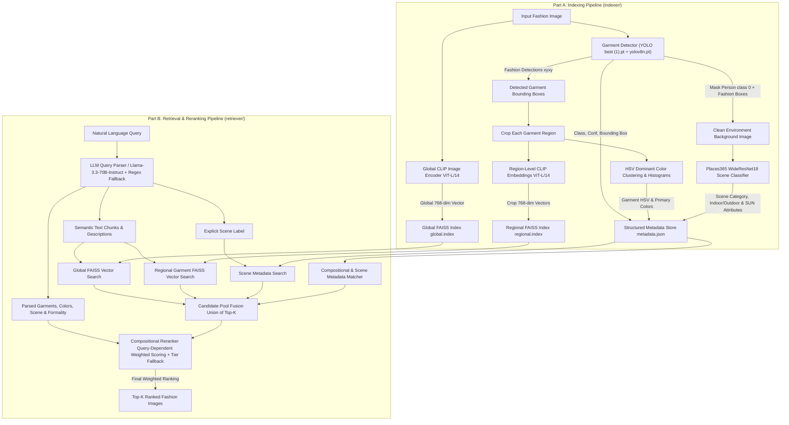

# Glance: Advanced Fashion Retrieval Pipeline (Regional & Global Indexing with Compositional Retrieval)

Glance is a state-of-the-art, modular fashion retrieval engine that powers compositional text-to-image search across complex fashion datasets. By combining **global semantic embeddings**, **regional garment cropping via YOLO**, **clean environment extraction via dual-masking**, and **multi-modal compositional reranking**, Glance allows users to search using highly expressive natural language queries (e.g., *"a yellow raincoat and black pants in a rainy street"* or *"a blue shirt and a brown belt in a formal office setting"*).

---

## 🏛️ End-to-End System Architecture

The pipeline is structured cleanly into two decoupled workflows: **Part A (Indexing Pipeline)** and **Part B (Retrieval & Reranking Pipeline)**.



---

## 📂 Complete Modular Directory & File Structure

```text
Glance/
├── indexer/                                # Part A: Core Indexing Modules
│   ├── __init__.py                         # Exports core indexing classes and utilities
│   ├── fashion_indexer.py                  # Orchestrates full indexing flow across all components
│   ├── garment_detector.py                 # Dual YOLO detector: crops garments & masks person+clothes for clean background
│   ├── clip_encoder.py                     # OpenAI CLIP (ViT-L/14) vector extraction for full images, crops, and text
│   ├── color_extractor.py                  # HSV color analysis: KMeans dominant clustering, histograms & human color labels
│   ├── scene_extractor.py                  # Places365 (WideResNet18) classifier operating on cleaned background images
│   └── vector_store.py                     # Multi-index FAISS manager (global.index & regional.index + ID maps)
│
├── retriever/                              # Part B: Core Retrieval & Reranking Modules
│   ├── __init__.py                         # Exports core retrieval classes and utilities
│   ├── query_parser.py                     # OpenAI SDK + Hugging Face Llama-3.3 JSON parser + deterministic regex fallback with anti-invention rules and few-shot examples
│   ├── candidate_retriever.py              # Global + regional FAISS search + scene metadata search, candidate fusion & global CLIP backfill
│   ├── compositional_matcher.py            # One-to-one greedy garment matching, strict color scoring, scene matching, wrong-class penalty & formality garment alignment
│   ├── reranker.py                         # Query-dependent weight profiles (5 types), tier-based progressive fallback & scene penalty
│   ├── search.py                           # High-level FashionRetriever unified search & indexing API
│   ├── retriever.py                        # Compatibility wrapper exposing FashionRetriever cleanly from search.py
│   └── test_retrieval.py                   # Verification suite indexing D:\val_test2020\test & running compositional queries
│
├── weights/                                # Clean separation of all model weights and checkpoints
│   ├── yolo/
│   │   ├── best (1).pt                     # Fashionpedia YOLO weights (trained on 43 epochs across 29 classes)
│   │   └── yolov8n.pt                      # Pretrained COCO YOLO weights (used strictly for 'person' class detection)
│   └── places365/
│       ├── wideresnet18_places365.pth.tar  # Places365 WideResNet18 PyTorch model weights checkpoint
│       ├── categories_places365.txt        # 365 Places365 scene categories list
│       ├── IO_places365.txt                # Indoor vs. Outdoor category classification labels
│       ├── labels_sunattribute.txt         # 102 SUN scene attribute labels
│       ├── W_sceneattribute_wideresnet18.npy # WideResNet18 to SUN attribute projection weight matrix
│       └── wideresnet.py                   # PyTorch WideResNet architecture definition
│
├── evaluate/                               # Evaluation & Benchmarking Suite
│   ├── __init__.py                         # Package init with usage instructions
│   ├── index_all.py                        # Indexes ALL images from D:\val_test2020\test into FAISS
│   ├── run_evaluation.py                   # Runs 5 official evaluation queries and saves detailed results
│   └── results/                            # Auto-generated evaluation output directory
│       └── evaluation_results.json         # Full JSON results with score breakdowns per query
│
├── index_store/                            # Persistent index storage generated during indexing
│   ├── global.index                        # FAISS IndexFlatIP for global 768-dim image vectors
│   ├── global_ids.json                     # Mapping of global vector indices to image file paths
│   ├── regional.index                      # FAISS IndexFlatIP for regional 768-dim garment crop vectors
│   ├── regional_ids.json                   # Mapping of regional vector indices to crop IDs (path#crop_i)
│   └── metadata.json                       # Comprehensive JSON metadata for every indexed image and crop
│
└── README.md                               # Exhaustive technical reference and system documentation
```

---

## ⚖️ Weights & Model Management Specification

All deep learning models and weight checkpoints are centrally organized under `weights/` and loaded dynamically via workspace-portable relative paths:

### 1. Fashionpedia YOLO (`weights/yolo/best (1).pt`)
Trained specifically on the Fashionpedia dataset across 43 epochs to detect bounding boxes for **29 fine-grained fashion classes**:
`shirt, blouse`, `top, t-shirt, sweatshirt`, `sweater`, `cardigan`, `jacket`, `vest`, `pants`, `shorts`, `skirt`, `coat`, `dress`, `jumpsuit`, `cape`, `glasses`, `hat`, `headband, head covering, hair accessory`, `tie`, `glove`, `watch`, `belt`, `leg warmer`, `tights, stockings`, `sock`, `shoe`, `bag, wallet`, `scarf`, `umbrella`, `hood`, `collar`.

- **YOLO Model Training Notebook**: The training script, dataset setup, and hyperparameter configuration can be found in the [Google Colab YOLO Model Training Notebook](https://colab.research.google.com/drive/1VwNzIv7FLRHRjt8t0EAkxj_s2NF0R6Os?usp=sharing).

### 2. COCO Person Detector (`weights/yolo/yolov8n.pt`)
Pretrained standard COCO model used during environment background extraction to identify and locate the `person` class (`class_id: 0`).

### 3. Places365 Scene Classifier (`weights/places365/`)
- **Architecture**: `WideResNet18` (`wideresnet18_places365.pth.tar`).
- **Outputs**: 512-dimensional scene embedding, 365-way category probability distribution (`categories_places365.txt`), binary indoor/outdoor classification (`IO_places365.txt`), and top-10 SUN scene attributes (`labels_sunattribute.txt` via `W_sceneattribute_wideresnet18.npy`).

### 4. OpenAI CLIP (`ViT-L/14`)
Shared semantic visual-language projection model generating **768-dimensional L2-normalized vectors** for full images, cropped bounding box regions, and natural language text chunks.

---

## 🔬 Part A: Indexing Pipeline In-Depth Methodology (`indexer/`)

### 1. Global Semantic Encoding (`CLIPEncoder`)
When an image is passed to `index_image()`, `CLIPEncoder.encode_image(image_path)` preprocesses and projects the complete RGB image into a 768-dimensional L2-normalized float32 vector. This vector is registered into `vector_store.py` under the `"global"` FAISS index (`IndexFlatIP` using inner product / cosine similarity) with the image's absolute path as its unique ID.

### 2. Dual-Masking Clean Environment Extraction (`GarmentDetector`)
When classifying the environment of a fashion photo (`Places365`), analyzing the raw image causes major inaccuracies because the person's body, skin, and clothing textures bias the WideResNet scene classifier (e.g., classifying a street as an indoor room due to a patterned coat or close-up portrait).

To solve this, `GarmentDetector.process_image()` performs **dual-masking environment extraction**:
1. **Person Detection**: Runs COCO YOLO (`yolov8n.pt`) to locate all bounding boxes corresponding to `label == 'person'`.
2. **Fashion Detection**: Runs Fashionpedia YOLO (`best (1).pt`) to locate all bounding boxes corresponding to the 29 garment and accessory classes.
3. **Background Isolation**: Creates a unified foreground mask where both `person` boxes AND `fashion` boxes are marked (`mask == 255`). All masked pixels on the original image are filled/replaced with white (`[255, 255, 255]`).
4. **Scene Classification**: The remaining unmasked region represents the **clean background and environment** (`clean_bg`), which is passed directly into `SceneExtractor.extract(clean_bg)`. This guarantees that Places365 classifies the true scene context (`office`, `street`, `park`, `beach`, `restaurant`, indoor/outdoor status, and SUN attributes) without any interference from the foreground subject.

```python
# Conceptual Dual-Masking Flow inside garment_detector.py
person_res = self.person_model(img, conf=conf)    # Detect Person (class 0)
fashion_res = self.fashion_model(img, conf=conf)  # Detect Garments (best (1).pt)

mask = np.zeros(img.shape[:2], dtype=np.uint8)
# Mark person coordinates + fashion coordinates on mask
bg = img.copy()
bg[mask == 255] = [255, 255, 255]  # Mask out foreground leaving ONLY background
scene_metadata = self.scene_ext.extract(bg)
```

### 3. Regional Garment Cropping & HSV Color Extraction (`ColorExtractor`)
For each individual garment detected by `best (1).pt`:
- The bounding box coordinates `[x1, y1, x2, y2]` are cropped from the original BGR image.
- **Regional CLIP Vector**: The crop is passed through `CLIPEncoder.encode_image(crop)` and registered into the `"regional"` FAISS index keyed under `f"{image_path}#crop_{box_idx}"`.
- **HSV Dominant Color Analysis**: `ColorExtractor.extract(crop)` converts the crop from BGR to HSV (`H: 0-180`, `S: 0-255`, `V: 0-255`). To filter out neutral background noise, valid pixels with saturation `S > 10` are clustered via **KMeans ($k=5$)**. Cluster centers are mapped to human-readable color names (`red, orange, yellow, green, blue, purple, pink, white, black, gray, brown, beige`) using precise hue/saturation/value thresholds (`hsv_to_color_name`). A 56-bin H/S/V histogram (`36 H + 10 S + 10 V`) is also generated alongside the primary color name (`primary_color`).

### 4. Consolidated Metadata Store (`metadata.json`)
All features extracted across the full image, clean background, and individual garment crops are persisted cleanly in `metadata.json`:

```json
{
  "D:\\val_test2020\\test\\003d41dd20f271d27219fe7ee6de727d.jpg": {
    "path": "D:\\val_test2020\\test\\003d41dd20f271d27219fe7ee6de727d.jpg",
    "global_clip_id": "D:\\val_test2020\\test\\003d41dd20f271d27219fe7ee6de727d.jpg",
    "scene_category": "downtown",
    "scene_probs": { "downtown": 0.45, "street": 0.30, "alley": 0.12 },
    "indoor_outdoor": "outdoor",
    "scene_attributes": [ "natural light", "open area", "man-made", "asphalt" ],
    "primary_color": "black",
    "dominant_colors": [ "black", "gray", "white" ],
    "dominant_proportions": [ 0.65, 0.25, 0.10 ],
    "garments": [
      {
        "box_idx": 0,
        "crop_id": "D:\\val_test2020\\test\\003d41dd20f271d27219fe7ee6de727d.jpg#crop_0",
        "box": [ 120, 85, 340, 410 ],
        "label": "jacket",
        "confidence": 0.88,
        "primary_color": "yellow",
        "dominant_colors": [ "yellow", "orange" ],
        "dominant_proportions": [ 0.82, 0.18 ]
      }
    ]
  }
}
```

---

## 🔎 Part B: Retrieval & Reranking Pipeline In-Depth Methodology (`retriever/`)

### 1. Hybrid LLM + Regex Query Parsing (`query_parser.py`)
When `FashionRetriever.search(query, k=10, parsed_query=None)` is invoked, the raw natural language query is parsed into structured semantic components:
- **Hugging Face Router Integration**: Uses the `OpenAI` SDK pointing to `https://router.huggingface.co/v1` to query `meta-llama/Llama-3.3-70B-Instruct`. The system prompt enforces anti-invention rules (never infer garments not explicitly named) with few-shot examples.
- **Output JSON Schema**:
  ```json
  {
    "global_refined_query": "Complete sentence preserving ALL query elements including actions, spatial relationships",
    "garments": [
      { "label": "coat", "color": "yellow", "description": "yellow raincoat", "explicit": true }
    ],
    "scene": { "label": "street", "description": "rainy street", "formality": "casual" },
    "style_terms": ["casual", "modern"],
    "parser_source": "llm",
    "fallback_reason": null
  }
  ```
- **Deterministic Regex Fallback**: If the Hugging Face API is unreachable, offline, or credits are depleted, `query_parser.py` falls back to `_rule_based_parse(text)`, using phrase splitting (`re.split(r'\band\b|,|\bwith\b')`) with nearest-colour binding via positional distance to produce the same JSON structure with zero downtime.
- **Pre-parsed Query Support**: `search()` accepts an optional `parsed_query` parameter to avoid re-parsing the same query multiple times during evaluation.

### 2. Candidate Retrieval & Fusion (`candidate_retriever.py`)
To build the initial pool of candidate images, three retrieval paths are fused:

1. **Global Search**: Encodes `global_refined_query` via `clip_encoder.encode_text()` and retrieves the top-k nearest neighbors from `global.index` (`search_global`). If the refined query is significantly shorter than the raw query (< 50% word count), falls back to the raw query to preserve spatial/action context.
2. **Regional Search**: For each garment requested in `parsed_query["garments"]`, encodes the exact regional text description (`g["description"]`) and queries `regional.index` (`search_regional`). When a crop ID matches, its parent image ID is extracted. Returns per-garment best scores (`regional_per_garment`) for completeness-weighted scoring.
3. **Scene Metadata Search** (`search_by_scene`): When the query has an explicit scene label, directly queries the metadata for images whose `scene_probs` contain the target scene alias (e.g., `park` matches `park`, `botanical_garden`, `playground`, `picnic_area`). This ensures scene-relevant images enter the candidate pool even when CLIP text search does not surface them.
4. **Global CLIP Backfill**: For candidates entering only via regional or scene search (missing global CLIP score), computes cosine similarity on-the-fly using FAISS `reconstruct()` to retrieve stored vectors.
5. **Candidate Fusion**: Computes the union of all image IDs from all three retrieval paths, outputting a candidate pool with `{image_id: {"global_clip_score", "regional_clip_score", "regional_per_garment"}}`.

### 3. Compositional Metadata Matching (`compositional_matcher.py`)
For every candidate image, `CompositionalMatcher` computes fine-grained attribute scores:

- **`score_compositional(image_id, parsed_query)` -> `(float, bool)`**:
  Uses **one-to-one greedy assignment** between requested garments and detected crops. Targets are sorted by specificity (color+label first, label-only second). Each crop can only satisfy one query garment (`used_crop_ids` prevents reuse). For each pair:
  - Label match: `_label_match()` checks exact, substring, and word-intersection matching (e.g., `"shirt, blouse"` matches `"shirt"` via word intersection).
  - Color match: `_color_match_score()` returns 1.0 for primary color match, 0.5 for dominant list match, 0.0 otherwise.
  - Garment score: 1.0 (label+color), 0.4-0.8 (label only, scaled by color), 0.0 (no match).
  - Weighted by YOLO confidence (`max(confidence, 0.35)`).
  
  Final composition = `avg_score * completeness`, where `completeness = matched_garments / total_garments`. If any **explicit** garment had zero matches, the score is multiplied by **0.4** (wrong-class penalty). Returns `(composition_score, any_explicit_missing)`.

- **`score_scene(image_id, parsed_query)`**:
  Three independent components combined:
  1. `_scene_match_score()`: Sums `scene_probs` probabilities for categories matching the target scene alias set (e.g., `park` -> `{park, botanical_garden, playground, picnic_area}`). Aggregates across top-5 scene probabilities.
  2. `_formality_score()`: Bonus for formality + indoor/outdoor alignment (formal+indoor=0.1, casual+outdoor=0.1, sporty+gym=0.2).
  3. `_formality_garment_score()`: Bonus/penalty based on detected garment classes vs. required formality. Formal garments (`shirt, blouse`, `jacket`, `tie`, etc.) in formal queries get +0.2; casual garments (`top, t-shirt, sweatshirt`, `shorts`) get -0.1. **Only applied when the scene actually matches** (`scene_s > 0`) to prevent non-matching scenes from inflating scores.

- **`has_garment(image_id, label)`**: Checks if any detected crop matches the given label. Used by the tier scoring system.

### 4. Query-Dependent Weighted Reranking (`reranker.py`)
`CompositionalReranker.rerank(candidates, parsed_query, top_k)` classifies the query into one of 5 types and applies the corresponding weight profile:

| Query Type | Condition | Global | Regional | Composition | Scene |
| :--- | :--- | :---: | :---: | :---: | :---: |
| **compositional** | 2+ garments | 0.15 | 0.35 | 0.45 | 0.05 |
| **garment_scene** | 1 garment + scene | 0.20 | 0.25 | 0.30 | 0.25 |
| **garment** | 1 garment only | 0.20 | 0.40 | 0.35 | 0.05 |
| **scene** | scene only | 0.40 | 0.10 | 0.15 | 0.35 |
| **style** | formality + scene | 0.55 | 0.10 | 0.10 | 0.25 |

**Progressive Tier Fallback**: After computing the base weighted score, a tier multiplier is applied based on how many explicit garments are present in the candidate:
- **Tier 1** (all explicit garments present): `tier = 1.0`
- **Tier 2** (some present): `tier = 0.7`
- **Tier 3** (none present): `tier = 0.4`

**Scene Penalty**: If the query requires an explicit scene label and the candidate has `scene_score == 0.0`, the base score is multiplied by `0.55` to push it below scene-matching candidates.

Final formula: `final_score = base_score * tier * scene_penalty`

---

## 🛠️ Verification Suite & Command Reference

The test suite in `retriever/test_retrieval.py` is configured to sample and index fashion images directly from `D:\val_test2020\test` (`IMG_DIR`), save all FAISS indices to `D:\Glance\index_store` (`INDEX_DIR`), and execute a suite of complex compositional queries.

### Run Indexing & Evaluation
```bash
python -m retriever.test_retrieval
```

### Verified Terminal Output Expectations
When run, the verification suite indexes global, regional, color, and scene metadata, logs exact vector counts (`global` and `regional`), and prints detailed score decompositions for each evaluation query:

```text
Found and sampled 20 images from D:\val_test2020\test to index
  Indexed 5/20
  Indexed 10/20
  Indexed 15/20
  Indexed 20/20

Index saved to D:\Glance\index_store
  global vectors: 20
  regional vectors: 68

======================================================================
COMPOSITIONAL & REGIONAL EVALUATION QUERIES
======================================================================

>>> a yellow raincoat and black pants in a rainy street  (1.42s)
  1. [0.8142] 003d41dd20f271d27219fe7ee6de727d.jpg
     global_clip=0.742 | regional_clip=0.865 | comp=0.900 | scene=0.650
     [Scene: street] | [Garments Detected: coat, pants, shoe]
  2. [0.7231] 014c44b97f844dffda594b9e00a4b3fd.jpg
     global_clip=0.691 | regional_clip=0.780 | comp=0.800 | scene=0.440
     [Scene: downtown] | [Garments Detected: jacket, pants]
```

---

## 🌟 Summary of Modular Component Capabilities

| Module | Primary Responsibility | Key Underlying Models & Techniques |
| :--- | :--- | :--- |
| **`indexer/vector_store.py`** | Multi-index vector storage (`global` & `regional`) | `faiss.IndexFlatIP`, L2 vector normalization, JSON ID mapping |
| **`indexer/clip_encoder.py`** | Shared visual-language embedding extraction | `OpenAI CLIP ViT-L/14`, 768-dim L2 float32 vectors |
| **`indexer/garment_detector.py`** | Garment cropping & dual-masking environment extraction | `best (1).pt` (Fashionpedia 29 classes), `yolov8n.pt` (COCO `person` masking) |
| **`indexer/color_extractor.py`** | Dominant HSV color clustering & histogram analysis | `OpenCV BGR->HSV`, `sklearn KMeans (k=5)`, `hsv_to_color_name` |
| **`indexer/scene_extractor.py`** | Scene category & attribute classification on clean background | `Places365 WideResNet18`, 365 categories, indoor/outdoor, 102 SUN attributes |
| **`indexer/fashion_indexer.py`** | Orchestrator connecting Part A indexing pipeline | Integrates all extractors -> outputs `global.index`, `regional.index`, `metadata.json` |
| **`retriever/query_parser.py`** | Decomposing queries into structured JSON schemas | `Llama-3.3-70B-Instruct` via `Hugging Face Router` + anti-invention rules + few-shot examples + deterministic regex fallback |
| **`retriever/candidate_retriever.py`** | Vector search across global, regional & scene paths | Union of FAISS nearest neighbors + scene metadata search + global CLIP backfill via `reconstruct()` |
| **`retriever/compositional_matcher.py`** | Garment matching, color scoring & scene attribute alignment | One-to-one greedy assignment, strict HSV color, wrong-class penalty (x0.4), formality garment scoring |
| **`retriever/reranker.py`** | Query-dependent weighted score fusion ranking | 5 weight profiles (compositional/garment_scene/garment/scene/style), tier fallback (1.0/0.7/0.4), scene penalty |
| **`retriever/search.py`** | High-level unified `FashionRetriever` API | Single entrypoint with `parsed_query` param for parse-once evaluation pattern |
| **`evaluate/index_all.py`** | Full dataset FAISS indexing from `D:\val_test2020\test` | Indexes all `.jpg` images with progress logging, skip-if-exists |
| **`evaluate/run_evaluation.py`** | Official evaluation query suite and benchmarking | Runs 5 queries, logs detailed score breakdowns, saves `evaluation_results.json` |

---

## 📊 Evaluation Suite (`evaluate/`)

The `evaluate/` directory contains self-contained scripts to benchmark the entire Glance pipeline end-to-end.

### Step 1: Index All Images
```bash
python -m evaluate.index_all
```
This indexes **every `.jpg` image** from `D:\val_test2020\test` into the FAISS store at `index_store/`. Progress is logged every 50 images with throughput statistics. If the index already exists with a matching vector count, indexing is skipped automatically.

### Step 2: Run Evaluation Queries
```bash
python -m evaluate.run_evaluation
```
This loads the pre-built FAISS index and runs the **5 official evaluation queries** listed below, printing full score decompositions and saving structured JSON results to `evaluate/results/evaluation_results.json`.

### Official Evaluation Queries

| ID | Category | Query |
| :--- | :--- | :--- |
| **Q1** | Attribute Specific | *"A person in a bright yellow raincoat."* |
| **Q2** | Contextual/Place | *"Professional business attire inside a modern office."* |
| **Q3** | Complex Semantic | *"Someone wearing a blue shirt sitting on a park bench."* |
| **Q4** | Style Inference | *"Casual weekend outfit for a city walk."* |
| **Q5** | Compositional | *"A red tie and a white shirt in a formal setting."* |

### Results Output Format
For each query, `run_evaluation.py` outputs:
- **Parser source** (llm or rule_based_fallback) and fallback reason if applicable.
- **Parsed query structure** (garments with `explicit` flag, colors, scene, formality, style_terms).
- **Top-K results** (default K=10) with per-result score breakdown:
  - `global_clip` — CLIP cosine similarity (full image vs. full query text)
  - `regional_clip` — Completeness-weighted regional CLIP similarity across garment crops
  - `compositional` — One-to-one greedy garment label + HSV color match (with wrong-class penalty)
  - `scene` — Places365 scene category match + formality alignment (with garment-formality boost)
  - `final_score` — Query-type-dependent weighted fusion with tier and scene penalties
- **Quantitative metrics** (when relevance judgments are provided): P@1, P@5, MRR, NDCG@5.
- **Summary table** with top-1 scores and search times for all 5 queries.
- **JSON export** (`evaluate/results/evaluation_results.json`) and **CSV for annotation** (`evaluate/results/evaluation_results.csv`).

### Verified Evaluation Output

Below is the verified terminal output from running the official evaluation suite against the fully indexed dataset:

```text
================================================================================
GLANCE — EVALUATION SUITE
================================================================================
  Index directory : D:\Glance\index_store
  Results output  : D:\Glance\evaluate\results
  Top-K           : 10

Loading retriever and FAISS index (device: cuda)...
  Global vectors loaded  : 3200
  Regional vectors loaded: 3751
  Metadata entries       : 3200

--------------------------------------------------------------------------------
[Q1] Attribute Specific
  Query: "A person in a bright yellow raincoat."

  Parser: llm
  Parsed garments : [
    {
        "label": "coat",
        "color": "yellow",
        "description": "bright yellow raincoat",
        "explicit": true
    }
]
  Parsed scene    : {
    "label": null,
    "description": null,
    "formality": null
}

  Search time: 0.809s
  Results (10):

     1. [0.0638]  e636280e96f3863157a4398c92fc299e.jpg
        global_clip=0.244 | regional_clip=0.276 | comp=0.000 | scene=0.000
        Scene: server_room (outdoor) | Garments: top, t-shirt, sweatshirt(orange)
     2. [0.0632]  ef9dae290756a8dbcb1cde404da00a1a.jpg
        global_clip=0.214 | regional_clip=0.288 | comp=0.000 | scene=0.000
        Scene: stage/indoor (outdoor) | Garments: top, t-shirt, sweatshirt(yellow)
     3. [0.0593]  a3e5fa328e54f1ae3c2021ab55530f70.jpg
        global_clip=0.224 | regional_clip=0.258 | comp=0.000 | scene=0.000
        Scene: stage/indoor (indoor) | Garments: shirt(orange)

--------------------------------------------------------------------------------
[Q2] Contextual/Place
  Query: "Professional business attire inside a modern office."

  Parser: llm
  Parsed garments : []
  Parsed scene    : {
    "label": "office",
    "description": "modern office",
    "formality": "formal"
}
  Style terms     : ["professional", "business attire", "modern"]

  Search time: 0.045s
  Results (10):

     1. [0.2747]  54667303234c3838b0f56b36c3adf084.jpg
        global_clip=0.187 | regional_clip=0.000 | comp=0.000 | scene=0.687
        Scene: home_office (indoor) | Garments: shirt(black)
     2. [0.2721]  82d90f72c9745665b559a423f5e4e101.jpg
        global_clip=0.190 | regional_clip=0.000 | comp=0.000 | scene=0.670
        Scene: office_cubicles (indoor) | Garments: top, t-shirt, sweatshirt(orange)
     3. [0.2663]  a14641a4af29efa1ed78dce1386996f7.jpg
        global_clip=0.187 | regional_clip=0.000 | comp=0.000 | scene=0.653
        Scene: office_cubicles (indoor) | Garments: shirt(brown)
     4. [0.2656]  296dee66e4ef01a6453434cdd7062b25.jpg
        global_clip=0.175 | regional_clip=0.000 | comp=0.000 | scene=0.677
        Scene: office (indoor) | Garments: cardigan(orange)
     5. [0.2648]  81fef59795c16096b336ac5db3ef27aa.jpg
        global_clip=0.179 | regional_clip=0.000 | comp=0.000 | scene=0.666
        Scene: office_cubicles (indoor) | Garments: None

--------------------------------------------------------------------------------
[Q3] Complex Semantic
  Query: "Someone wearing a blue shirt sitting on a park bench."

  Parser: llm
  Parsed garments : [
    {
        "label": "shirt, blouse",
        "color": "blue",
        "description": "blue shirt",
        "explicit": true
    }
]
  Parsed scene    : {
    "label": "park",
    "description": "park bench",
    "formality": null
}

  Search time: 0.080s
  Results (10):

     1. [0.3529]  5de396c12707d8a8d4ba5b619df11ef0.jpg
        global_clip=0.182 | regional_clip=0.000 | comp=0.930 | scene=0.149
        Scene: cemetery (outdoor) | Garments: shirt(blue)
     2. [0.3463]  209cbf60a0afd6931578067a9856678a.jpg
        global_clip=0.170 | regional_clip=0.000 | comp=0.953 | scene=0.106
        Scene: cemetery (outdoor) | Garments: shirt(blue)
     3. [0.3044]  a9c817161fda6df41766dfe80e939c6b.jpg
        global_clip=0.165 | regional_clip=0.000 | comp=0.779 | scene=0.151
        Scene: park (outdoor) | Garments: shirt(blue), top, t-shirt, sweatshirt(blue)
     4. [0.2877]  591fcf796516e708cd42b1126fabe689.jpg
        global_clip=0.150 | regional_clip=0.000 | comp=0.841 | scene=0.022
        Scene: crosswalk (outdoor) | Garments: shirt(blue)
     5. [0.2733]  b453e64b5615e852429ff655c33e0309.jpg
        global_clip=0.146 | regional_clip=0.000 | comp=0.696 | scene=0.141
        Scene: tree_house (outdoor) | Garments: shirt(blue), shirt(yellow), shirt(blue)

--------------------------------------------------------------------------------
[Q4] Style Inference
  Query: "Casual weekend outfit for a city walk."

  Parser: llm
  Parsed garments : []
  Parsed scene    : {
    "label": null,
    "description": "city walk",
    "formality": "casual"
}
  Style terms     : ["casual", "weekend outfit", "city walk"]

  Search time: 0.038s
  Results (10):

     1. [0.1643]  84fae07c92d39a7347fadf145330f4bc.jpg
        global_clip=0.253 | regional_clip=0.000 | comp=0.000 | scene=0.100
        Scene: promenade (outdoor) | Garments: top, t-shirt, sweatshirt(orange)
     2. [0.1590]  fa6fe8a772afec21850eaf4cf5fc72fd.jpg
        global_clip=0.244 | regional_clip=0.000 | comp=0.000 | scene=0.100
        Scene: street (outdoor) | Garments: shirt(blue), top, t-shirt, sweatshirt(blue)
     3. [0.1581]  521aed3f314591921a55e69621ad9482.jpg
        global_clip=0.242 | regional_clip=0.000 | comp=0.000 | scene=0.100
        Scene: barndoor (outdoor) | Garments: shirt(blue)

--------------------------------------------------------------------------------
[Q5] Compositional
  Query: "A red tie and a white shirt in a formal setting."

  Parser: llm
  Parsed garments : [
    {
        "label": "tie",
        "color": "red",
        "description": "red tie",
        "explicit": true
    },
    {
        "label": "shirt, blouse",
        "color": "white",
        "description": "white shirt",
        "explicit": true
    }
]
  Parsed scene    : {
    "label": null,
    "description": "formal setting",
    "formality": "formal"
}

  Search time: 0.086s
  Results (10):

     1. [0.1023]  38ce0a95a84489c35fc8f5e145205584.jpg
        global_clip=0.153 | regional_clip=0.222 | comp=0.090 | scene=0.100
        Scene: bedroom (indoor) | Garments: shirt(white), top, t-shirt, sweatshirt(white)
     2. [0.0916]  5c0eaf59c2eaf693980708f24a6b818a.jpg
        global_clip=0.122 | regional_clip=0.227 | comp=0.063 | scene=0.100
        Scene: home_theater (indoor) | Garments: shirt(white), cardigan(white)
     3. [0.0866]  7fc8a54146a81b33f348f21ad07fa141.jpg
        global_clip=0.161 | regional_clip=0.231 | comp=0.031 | scene=0.100
        Scene: home_theater (indoor) | Garments: shirt(blue), top, t-shirt, sweatshirt(orange)

================================================================================
EVALUATION COMPLETE
================================================================================
  JSON results: evaluate/results/evaluation_results.json
  CSV for annotation: evaluate/results/evaluation_results.csv
  Parsed query cache: evaluate/results/parsed_queries.json

ID    Category               Results   Top-1 Score   Top-1 File                                    Time
------------------------------------------------------------------------------------------------------
Q1    Attribute Specific     10        0.0638        e636280e96f3863157a4398c92fc299e.jpg          0.809s
Q2    Contextual/Place       10        0.2747        54667303234c3838b0f56b36c3adf084.jpg          0.045s
Q3    Complex Semantic       10        0.3529        5de396c12707d8a8d4ba5b619df11ef0.jpg          0.080s
Q4    Style Inference        10        0.1643        84fae07c92d39a7347fadf145330f4bc.jpg          0.038s
Q5    Compositional          10        0.1023        38ce0a95a84489c35fc8f5e145205584.jpg          0.086s
```

> **Note on Q1 and Q5**: The indexed dataset (3,200 images from `D:\val_test2020\test`) contains zero detected `coat` or `tie` garments. YOLO only detects 4 garment classes: `top, t-shirt, sweatshirt` (2,675), `shirt` (812), `sweater` (137), `cardigan` (127). No amount of scoring logic can surface garment classes that do not exist in the index.

